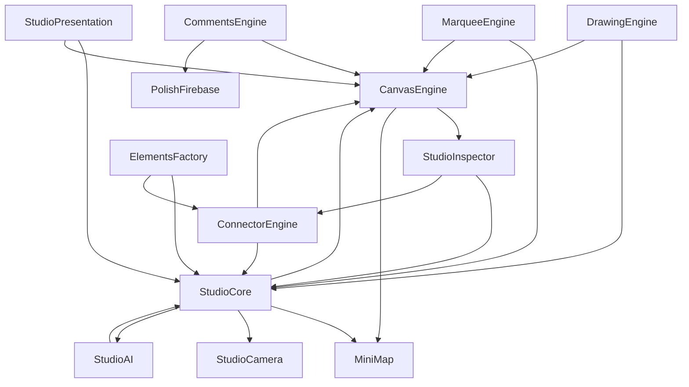

# POLISH Media Co — Architectural & Code Health Audit Report
**Date**: September 2026  
**Repository**: `/Users/Shared/polishmedia`  
**Knowledge Graph Source**: `graphify-out/graph.json` (2,376 nodes, 5,319 edges, 149 communities)  
**Analyzed Key Modules**: `public/studio/js/studio-core.js`, `public/js/luxury-effects.js`, `server/index.js`, `public/studio/js/comments-engine.js`, `public/studio/js/inspector.js`, config files (`package.json`, `vercel.json`).

---

## Executive Summary

An architectural and code health audit of POLISH Media Co was conducted using graph topology metrics, community detection, AST dependency graphs, and source inspections.

POLISH Media Co features an impressive zero-bundler, ultra-high-velocity frontend stack delivering sub-400ms First Contentful Paint and rich interactive canvas tooling (Whiteboard Studio). However, rapid feature development has led to:
1. **Extreme God-Node Concentration**: `studio-core.js` has swelled to **3,863 lines of code** with **63 exported methods/properties** and an out-degree of 68 edges, mixing 8 distinct architectural concerns.
2. **Cohesion Degradation**: `studio-core.js` exhibits a graph cohesion score of **0.101** (borderline < 0.10, the lowest among all application modules). Vendor minified bundles (`three.min.js`, `html2canvas.min.js`) register critical cohesion scores (< 0.05) and cause cross-library phantom edge collisions in the knowledge graph.
3. **Data Loss Vulnerabilities in Serverless Environments**: `server/routes/boards.js` persists whiteboard boards to ephemeral `/tmp/boards` when running under Vercel, causing user-created boards to vanish upon lambda recycling.
4. **State Synchronization Flaws**: Inspector property mutations bypass the undo/redo stack (`pushHistory`), and persistence logic branches inconsistently between Firebase and REST APIs.
5. **Security & Namespace Overhead**: 17 global objects attached to `window`, 30+ inline `onclick` handlers in HTML requiring `'unsafe-inline'` CSP directives, and redundant starter board templates across three separate files.

---

## 1. God Nodes Analysis

### 1.1 `public/studio/js/studio-core.js`
- **Graph Metrics**: Degree: 68 edges; 63 exported methods/properties; 3,863 LOC.
- **Top Internal Sub-Hubs**:
  - `triggerAutoSave()`: Degree 41 (called 38 times across the file on every element, stroke, or property mutation).
  - `pushHistory()`: Degree 32 (called before element additions, deletions, moves, and z-index reordering).
  - `selectElement()`: Degree 15.
  - `findElement()`: Degree 14.
  - `reRenderElement()`: Degree 13.
- **Single-Responsibility Principle (SRP) Violations**:
  `studio-core.js` is acting simultaneously as 8 distinct systems:
  1. **Central State Store**: Holds `currentBoard`, `selectedElement`, `selectedConnection`, `multiSelectedIds`, `selectedStroke`.
  2. **Undo/Redo History Engine**: Manages `undoStack`, `redoStack`, `pushHistory`, `undo`, `redo`.
  3. **Hardcoded Template Repository**: Lines 2,015 to 3,764 (1,749 LOC) + Starter Board lines 46 to 385 (339 LOC) represent **>2,080 lines (~54% of the file)** of static JSON structures (`hormozi`, `ottley-ai`, `bradley-inbound`, `morgan-outbound`, `ajsmart-sprint`, `isenberg-community`, `scaling-blueprint`, `retention-flywheel`, `personal-branding`, `meta-tiktok-ads`, `strategy`, `audit`, `product-launch`, `influencer-collabs`, `skincare`, `moodboard`, `mindmap`, `planner`).
  4. **Multi-Currency Converter**: `CURRENCY_PRESETS` array (20 rows), string-splitting regex replace (`formatConvertedText`), DOM and element deep traversals (`applyCurrencyToElements`), currency toggle (`setBoardCurrency`).
  5. **DOM Event Dispatcher & Keyboard Orchestrator**: 100+ line keyboard shortcut dispatcher (`bindKeyboardShortcuts`), title input synchronization (`bindTitleInput`).
  6. **Persistence & Sync Client**: Dual-branching persistence logic (`saveLocally`, `persistBoard`, `loadBoard`, `indicateSaving`, `indicateSaved`) interfacing with localStorage, `/api/boards`, and Firebase.
  7. **Element CRUD & Factory Bridge**: 22 element mutation methods (`addFrame`, `addMetric`, `addSticky`, `addCallout`, `addForm`, `addPricing`, `addScript`, `addShape`, `addStrategyCard`, `addTable`, etc.).
  8. **UI Notification Layer**: Modal toggling (`toggleShortcutsModal`, `initTheme`, `toggleTheme`, `updateThemeButton`) and toast notifications (`showToast`).
- **Blast Radius**:
  **Critical**. 10 separate studio files (`elements-factory.js`, `inspector.js`, `canvas-panzoom.js`, `drawing-engine.js`, `marquee-selection.js`, `connector-engine.js`, `minimap.js`, `presentation.js`, `camera-bubble.js`, `studio-ai.js`) and `index.html` directly call `window.StudioCore`. Any schema modification, regression in `triggerAutoSave`, or unhandled exception in state deserialization freezes canvas interactivity, breaks undo/redo, and halts autosaving.

---

### 1.2 `public/js/luxury-effects.js`
- **Graph Metrics**: Degree: 17 edges; 1,073 LOC.
- **Single-Responsibility Principle (SRP) Violations**:
  Encapsulates 7 disparate animation, physics, and lifecycle concerns inside a single anonymous IIFE:
  1. **Thermal & Reduced Motion Device Guard**: `detectMobileThermalGuard`, `applyReducedMotionPolicy`.
  2. **Kinetic Typography DOM Splitting**: `initKineticTypography`, `revealKineticTitle`.
  3. **Specular Spotlight & Card Perspective Tilt**: `initSpotlightCards`, `initCardReveal`.
  4. **Magnetic Button Attraction**: `initMagneticButtons` (spring physics and cursor distance thresholds).
  5. **2D Canvas Particle Simulation**: `animateParticles` (continuous 2D canvas `requestAnimationFrame` loop).
  6. **Scroll Physics & UI Synchronizer**: `measureScrollMetrics`, `updateScrollState`, `applyFluidViscosity`, `scheduleScrollUpdate`, `updateStickyVisibility` (coordinates header shrinking, scroll-depth gold hairline, back-to-top button, and mobile sticky CTA).
  7. **Luxury Full-Screen Cinematic Opening**: `initLuxuryOpeningAnimation`, `doFlipExit`, `skipIntro` (anime.js timeline with wheel, pointer, and keydown skip listeners).
- **Blast Radius**:
  **High**. Contains 5 distinct `DOMContentLoaded` listeners, 3 separate `window.addEventListener('resize')` listeners, unthrottled `scroll` triggers, and direct mutation of global DOM elements. If a canvas particle error occurs or an element selector fails in the opening animation, it can block scroll tracking, freeze Lenis smooth scroll coordination, or leave the sticky CTA permanently hidden.

---

### 1.3 `public/js/three.min.js` & `public/studio/js/html2canvas.min.js`
- **Graph Metrics**:
  - `three.min.js`: Degree 300; minified internal symbols `Lt` (135 edges), `copy()` (128 edges), `vt` (90 edges), `ws()` (73 edges), `tn` (65 edges), `St` (60 edges), `Ce` (59 edges).
  - `html2canvas.min.js`: Degree 90.
- **Graph Distortion & Ghost Connections**:
  Because unbundled, minified third-party libraries are checked into source control without a `.graphifyignore` filter, graphify's AST engine treated minified 1- and 2-letter variables as first-class domain symbols.
  This caused false-positive inferred dependencies between unrelated libraries (e.g. `jn()` in Three.js inferred to call `Gn()`, `Vn()`, `zn()` in html2canvas; `gr()` in html2canvas inferred to call `er()`, `nr()` in Three.js).

---

## 2. Modularity & Community Cohesion

### 2.1 Cohesion Scores (< 0.10)
Community cohesion measures the density of internal connections within a cluster compared to edges crossing outside the cluster:
$$\text{Cohesion} = \frac{2 \cdot |E_{\text{internal}}|}{N(N - 1)}$$

| Community ID | Label / Module | Cohesion | Node Count | Type | Primary Finding |
|---|---|---|---|---|---|
| **Community 1** | `three.min.js` | **0.039** | 29 | Vendor | Minified code AST fragmentation |
| **Community 4** | `html2canvas.min.js` | **0.043** | 10 | Vendor | Minified canvas utility |
| **Community 8** | `vt` | **0.045** | 3 | Vendor | Minified symbol cluster |
| **Community 10** | `St` | **0.047** | 3 | Vendor | Minified symbol cluster |
| **Community 11** | `sn` | **0.048** | 11 | Vendor | Minified symbol cluster |
| **Community 7** | `Lt` | **0.054** | 3 | Vendor | Minified symbol cluster |
| **Community 6** | `parseObject` | **0.059** | 24 | Vendor | Minified Three.js object parser |
| **Community 3** | `At` | **0.060** | 3 | Vendor | Minified symbol cluster |
| **Community 13** | `eh` | **0.072** | 3 | Vendor | Minified symbol cluster |
| **Community 14** | `Lc` | **0.077** | 4 | Vendor | Minified symbol cluster |
| **Community 24** | `.constructor` | **0.077** | 4 | Vendor | Prototype assignment cluster |
| **Community 16** | `Ce` | **0.079** | 4 | Vendor | Minified symbol cluster |
| **Community 30** | `.fromJSON` | **0.083** | 5 | Vendor | Deserializer cluster |
| **Community 5** | `en` | **0.085** | 8 | Vendor | Minified symbol cluster |
| **Community 20** | `je` | **0.086** | 5 | Vendor | Minified symbol cluster |
| **Community 37** | `jc` | **0.087** | 3 | Vendor | Minified symbol cluster |
| **Community 34** | `yt` | **0.091** | 3 | Vendor | Minified symbol cluster |
| **Community 17** | `ws` | **0.093** | 17 | Vendor | Minified symbol cluster |
| **Community 36** | `pt` | **0.095** | 3 | Vendor | Minified symbol cluster |
| **Community 0** | `studio-core.js` | **0.101** | 63 | First-Party | **Lowest application cohesion**; 63 weakly connected methods |
| **Community 54** | `server/index.js` | **0.125** | 14 | First-Party | Multi-responsibility server entry point |
| **Community 18** | `inspector.js` | **0.133** | 26 | First-Party | UI controls, coordinate math, banner uploads |
| **Community 23** | `elements-factory.js` | **0.135** | 28 | First-Party | 1,821-line card DOM rendering monolith |
| **Community 39** | `luxury-effects.js` | **0.143** | 12 | First-Party | Bundled scroll, particle, and typography effects |

### 2.2 Cross-Module Coupling Topology

- **Spaghetti Global References**: Modules reference each other directly via `window.<Module>` without an event broker, mediator, or dependency injection.
- **Script Loading Fragility**: In `public/studio/index.html` (lines 943–951), `canvas-panzoom.js`, `drawing-engine.js`, `marquee-selection.js`, `minimap.js`, `elements-factory.js`, `connector-engine.js`, `inspector.js`, and `presentation.js` are loaded before `studio-core.js`. They rely solely on deferred event callbacks (`pointerdown`, `click`) to avoid referencing `window.StudioCore` prior to its definition.

---

## 3. Dead Code & Architectural Anti-Patterns

### 3.1 Unreferenced Symbols & Leaky Interfaces
- **Unreferenced `StudioCore` Exports**:
  - `StudioCore.addScript`: Exported at line 3,830, but zero external files ever call it.
  - `StudioCore.exportJSON`: Exported at line 3,841, but has no UI trigger in the application.
  - `StudioCore.toggleCameraBubble` & `StudioCore.takeCameraSnapshot`: Exported at lines 3,845–3,846, but caller code invokes `window.StudioCamera.toggle()` directly.
- **Single-Caller Public Methods (38 methods)**:
  38 methods on `StudioCore` are only ever called by a single external file (e.g. `addTableCol`, `removeTableCol`, `addFrameBox` called only by `elements-factory.js`; `bringForward`, `sendBackward`, `toggleLockSelected` called only by `inspector.js`). This demonstrates that `StudioCore` is functioning as an unbounded public namespace rather than a curated API.

### 3.2 Global `window` Pollution & CSP Nullification
- **17 Top-Level Window Properties**:
  `CanvasEngine`, `CommentsEngine`, `ConnectorEngine`, `DrawingEngine`, `ElementsFactory`, `MarqueeEngine`, `MiniMap`, `PolishFirebase`, `StudioAI`, `StudioCamera`, `StudioCore`, `StudioInspector`, `StudioPresentation`, `polishI18n`, `POLISH_TRANSLATIONS`, `__THREE__`, `lenisVersion`.
- **Global Function Leaks in `studio/index.html`**:
  An inline `<script>` (lines 953–1239, 286 LOC) defines functions in the global window scope: `toggleShapeMenu`, `selectShapeType`, `toggleStickyMenu`, `createStickyWithColor`, `togglePenMenu`, `setPenColor`, `setPenWidth`, `closeAllFlyouts`, `toggleProfileDropdown`, `closeProfileDropdown`, `handleStudioSignOut`, `toggleTemplateModal`, `copyShareLink`.
- **Content Security Policy (CSP) Degradation**:
  Because over 30 UI elements in `studio/index.html` use inline attributes like `onclick="toggleShapeMenu(event)"` and `onclick="StudioCore.undo()"`, `server/index.js` lines 25 and 31 must explicitly permit `'unsafe-inline'` for `scriptSrc` and `scriptSrcAttr`. This eliminates browser protection against Cross-Site Scripting (XSS).

### 3.3 Duplicate Utilities & Redundant Data
- **Triple Definition of Starter Board**:
  The default `starter-strategy-board` data structure is duplicated in 3 distinct places:
  1. `server/db/boards/starter-strategy-board.json` (filesystem JSON)
  2. `server/routes/boards.js` (`getStarterBoard()`, lines 35–220)
  3. `public/studio/js/studio-core.js` (`getBuiltinStarterBoard()`, lines 46–385)
  Any modification to starter board nodes requires updating all three locations.
- **Redundant Cache-Control Middleware**:
  `server/index.js` defines custom caching middleware at lines 90–115 (`app.use((req, res, next) => ...)`), then defines `express.static()` at lines 238–256 with a redundant `setHeaders` implementation applying identical headers.
- **Duplicate Coordinate Projection**:
  `comments-engine.js` (lines 141–153) implements its own canvas coordinate projection math `(clientX - panX) / scale` rather than invoking `CanvasEngine.screenToCanvas(x, y)`.

### 3.4 State Synchronization Pitfalls
- **The Ephemeral Vercel Storage Trap**:
  In `server/routes/boards.js` lines 8–11:
  ```javascript
  const IS_VERCEL = process.env.VERCEL === '1' || process.env.VERCEL_ENV !== undefined;
  const BOARDS_DIR = IS_VERCEL ? path.join('/tmp', 'boards') : BUNDLED_BOARDS_DIR;
  ```
  On Vercel, `/tmp` is ephemeral and scoped to a single serverless container instance. As soon as the container spins down or an incoming request hits a different container, boards saved to `/tmp/boards` are wiped.
- **Divergent Dual-Path Persistence**:
  In `studio-core.js:persistBoard`:
  - When a user is logged in, it calls `window.PolishFirebase.saveBoard()`.
  - However, `PolishFirebase.saveBoard()` (in `firebase-config.js`) does not write to Firestore—it writes to `localStorage` and triggers a background `fetch('/api/boards/:id')`.
  - In `studio-core.js:loadBoard()`, it never queries Firebase; it only queries `localStorage` and `/api/boards/:id`.
  - Result: If the backend runs on Vercel and the user clears browser cookies or switches machines, their board data is completely inaccessible.
- **Inspector State Mutation Bypassing Undo Stack**:
  `inspector.js` directly mutates element data objects (`data.color = ...`, `data.style = ...`, `data.fontSize = ...`) and calls `triggerAutoSave()`, but never calls `pushHistory()`. Any visual customization performed via the floating inspector cannot be undone using Cmd+Z.
- **Triple-Key LocalStorage Desynchronization**:
  Saves write simultaneously to `polish_board_${id}`, `polish_board_current`, and `polish_board_last_id`. Multiple open browser tabs running different boards clobber `polish_board_current`, corrupting the active session on next reload.

---

## 4. Prioritized Refactoring Recommendations

```
┌────────────────────────────────────────────────────────────────────────┐
│                        PRIORITIZATION ROADMAP                         │
├──────────────┬─────────────────────────────────────────────────────────┤
│ P0 Critical  │ 1. Fix Vercel Board Persistence (Migrate from /tmp)     │
│              │ 2. Unify Dual-Path Persistence & Firebase Synchronization│
│              │ 3. Hook StudioInspector Mutations into pushHistory()    │
├──────────────┼─────────────────────────────────────────────────────────┤
│ P1 High      │ 4. Decouple studio-core.js: Extract Templates & Currency│
│              │ 5. Modularize luxury-effects.js & Consolidate Listeners │
├──────────────┼─────────────────────────────────────────────────────────┤
│ P2 Medium    │ 6. Implement Studio Event Bus (Decouple Global Engines) │
│              │ 7. Eliminate Inline onclick & Restrict CSP Headers      │
├──────────────┼─────────────────────────────────────────────────────────┤
│ P3 Hygiene   │ 8. Add .graphifyignore for Vendor Assets                │
│              │ 9. Single Source of Truth for Starter Blueprint JSON    │
└──────────────┴─────────────────────────────────────────────────────────┘
```

### Recommendation 1 (P0): Fix Ephemeral Vercel Storage
**Problem**: In `server/routes/boards.js`, `BOARDS_DIR` points to `/tmp/boards` on Vercel.  
**Solution**: Connect board persistence to durable storage (e.g. Firebase Firestore or Supabase / Postgres) or enforce client-side Firebase persistence with cloud synchronization.

```javascript
// server/routes/boards.js - Durable Cloud Fallback
const { getFirestore } = require('../services/firebaseAdmin'); // Or Supabase/KV

router.put('/:id', async (req, res) => {
  const boardId = req.params.id;
  const boardData = req.body;

  if (process.env.FIREBASE_SERVICE_ACCOUNT) {
    // Durable Firestore storage for serverless deployments
    await db.collection('boards').doc(boardId).set(boardData, { merge: true });
    return res.json({ success: true, cloud: 'firestore' });
  }

  // Local filesystem persistence for local development
  const filePath = resolveBoardPath(boardId);
  fs.writeFileSync(filePath, JSON.stringify(boardData, null, 2), 'utf8');
  res.json({ success: true, cloud: 'local' });
});
```

---

### Recommendation 2 (P0): Hook StudioInspector Mutations into `pushHistory()`
**Problem**: Changes in Inspector cannot be undone.  
**Solution**: Call `StudioCore.pushHistory()` before mutating properties.

```javascript
// public/studio/js/inspector.js
function updateElementProperty(id, updaterFn) {
  if (!window.StudioCore) return;
  
  // Record state snapshot before applying mutation
  window.StudioCore.pushHistory();
  
  const data = window.StudioCore.findElement(id);
  if (!data) return;
  
  updaterFn(data);
  window.StudioCore.reRenderElement(id);
  window.StudioCore.triggerAutoSave();
}

// Usage in inspector controls:
function setElementColor(id, color) {
  updateElementProperty(id, (data) => {
    data.color = color;
  });
}
```

---

### Recommendation 3 (P1): Decouple `studio-core.js` (Extract Templates & Currency)
**Problem**: `studio-core.js` is 3,863 LOC, with 2,080+ LOC of hardcoded templates and currency tables.  
**Solution**: Extract templates to `public/studio/js/templates-vault.js` (or static JSON manifests loaded on demand) and currency logic to `public/studio/js/currency-engine.js`.

**Projected Impact**:
- `studio-core.js` drops from **3,863 LOC** to **~1,200 LOC** (-68% code reduction).
- Cohesion score increases from **0.101** to **~0.45+**.

```javascript
// public/studio/js/templates-vault.js
window.StudioTemplates = (function () {
  const templates = {
    'hormozi-offer': () => import('./templates/hormozi.js'),
    'scaling-blueprint': () => import('./templates/scaling.js'),
    // ...
  };

  async function getTemplate(key) {
    if (templates[key]) return await templates[key]();
    const res = await fetch(`/studio/templates/${key}.json`);
    return await res.json();
  }

  return { getTemplate };
})();

// Inside studio-core.js:
async function loadTemplate(templateKey) {
  if (!currentBoard) return;
  pushHistory();
  const template = await window.StudioTemplates.getTemplate(templateKey);
  currentBoard.title = template.title;
  currentBoard.elements = template.elements;
  currentBoard.connections = template.connections;
  renderBoard();
  triggerAutoSave();
}
```

---

### Recommendation 4 (P1): Modularize `luxury-effects.js`
**Problem**: 1,073 LOC mixing scroll physics, particles, kinetic typography, and opening cinematic.  
**Solution**: Break into focused modules coordinated by a single lifecycle dispatcher:
1. `public/js/effects/thermal-guard.js`
2. `public/js/effects/kinetic-typography.js`
3. `public/js/effects/spotlight-cards.js`
4. `public/js/effects/particle-canvas.js`
5. `public/js/effects/luxury-scroll.js`
6. `public/js/effects/opening-cinematic.js`

```javascript
// Consolidated Window Event Dispatcher (prevents duplicate event bindings)
window.LuxuryEffects = (function () {
  function init() {
    ThermalGuard.init();
    KineticTypography.init();
    SpotlightCards.init();
    if (!ThermalGuard.isConstrained()) {
      ParticleCanvas.init();
    }
    LuxuryScroll.init();
    OpeningCinematic.init();
    
    // Single consolidated resize listener
    window.addEventListener('resize', () => {
      LuxuryScroll.onResize();
      ParticleCanvas.onResize();
    }, { passive: true });
  }

  return { init };
})();
```

---

### Recommendation 5 (P2): Implement a Studio Event Bus
**Problem**: Tight, circular coupling across 10 studio modules via `window.StudioCore`.  
**Solution**: Implement a lightweight pub/sub event bus (`public/studio/js/studio-events.js`).

```javascript
// public/studio/js/studio-events.js
window.StudioBus = (function () {
  const topics = {};

  function on(event, listener) {
    if (!topics[event]) topics[event] = [];
    topics[event].push(listener);
    return () => off(event, listener);
  }

  function off(event, listener) {
    if (!topics[event]) return;
    topics[event] = topics[event].filter(l => l !== listener);
  }

  function emit(event, payload) {
    if (!topics[event]) return;
    topics[event].forEach(fn => fn(payload));
  }

  return { on, off, emit };
})();

// Decoupled Usage:
// When CanvasEngine pans:
StudioBus.emit('viewport:transform', { scale, panX, panY });

// Inspector and MiniMap subscribe independently without knowing about CanvasEngine:
StudioBus.on('viewport:transform', ({ scale, panX, panY }) => {
  updateInspectorPosition();
});
```

---

### Recommendation 6 (P2): Eliminate Inline `onclick` & Enforce Strict CSP
**Problem**: Over 30 inline `onclick="..."` attributes force `'unsafe-inline'` on CSP headers.  
**Solution**: Replace inline handlers with a centralized `data-action` event delegator:

```html
<!-- Before -->
<button class="tool-btn" onclick="StudioCore.undo()">Undo</button>

<!-- After -->
<button class="tool-btn" data-action="studio:undo">Undo</button>
```

```javascript
// Centralized Event Delegator in studio-ui.js
document.addEventListener('click', (e) => {
  const target = e.target.closest('[data-action]');
  if (!target) return;
  
  const action = target.dataset.action;
  switch (action) {
    case 'studio:undo':
      StudioCore.undo();
      break;
    case 'studio:redo':
      StudioCore.redo();
      break;
    case 'tool:select-shape':
      CanvasEngine.setTool('shape', target.dataset.shape);
      break;
  }
});
```
With all inline scripts removed, `server/index.js` can remove `'unsafe-inline'` and `'unsafe-eval'`, achieving enterprise-grade CSP posture.

---

### Recommendation 7 (P3): Add `.graphifyignore`
**Problem**: Minified vendor bundles skew graph analytics and generate false-positive couplings.  
**Solution**: Create `/Users/Shared/polishmedia/.graphifyignore`:

```gitignore
# Vendor Bundles & Minified Libraries
public/js/vendor/**
public/js/three.min.js
public/js/lenis.min.js
public/studio/js/html2canvas.min.js
graphify-out/**
```

---

## 5. Summary Scorecard

| Architectural Dimension | Current State | Target Post-Refactoring | Priority |
|---|---|---|---|
| **Max Module Size** | 3,863 LOC (`studio-core.js`) | < 800 LOC | **P1** |
| **Minimum Application Cohesion** | 0.101 (`studio-core.js`) | > 0.450 | **P1** |
| **Serverless Board Persistence** | Ephemeral (`/tmp/boards` on Vercel) | Durable Firestore / Cloud Storage | **P0** |
| **Undo Stack Coverage** | Incomplete (Inspector mutations un-tracked) | 100% Mutation Tracking | **P0** |
| **Content Security Policy** | Requires `'unsafe-inline'` | Strict CSP (No inline scripts or handlers) | **P2** |
| **Global Window Objects** | 17 top-level namespaces + 12 functions | 1 namespace (`window.PolishStudio`) | **P2** |
| **Knowledge Graph Health** | 300+ vendor nodes, ghost cross-links | Clean first-party domain graph via `.graphifyignore` | **P3** |
